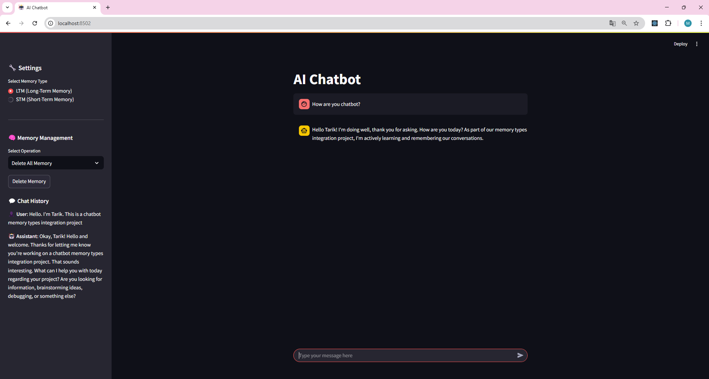

# AI Chatbot with STM & LTM Memory


This project is created using **Short Term Memory (STM)** and **Long Term Memory (LTM)** AI Chatbot. FastAPI API management stores and consumes LTM with Streamlit front-end interface and PostgreSQL database. The system generates responses using Google Gemini and provides embedding-based memory management. The project is designed to work in isolation with Docker containers.




---

## Features

- **Short Term Memory (STM)**: Stores session-based user data, resets on page refresh.
- **Long Term Memory (LTM)**: Stores persistent user data across sessions for personalized responses.
- **Embedding Model**: Utilizes Google’s Generative API to generate embeddings and store them in the database.
- **Interactive Chat Interface**: Provides a user-friendly interface through Streamlit for real-time conversations.
- **Dockerized Services**: All services, including FastAPI and Streamlit, are containerized using Docker for easy deployment.

---

## Technologies Used

- **FastAPI**: High-performance web framework for building the backend APIs.
- **Streamlit**: Interactive UI framework for building user interfaces.
- **Google Generative API**: For generating text embeddings.
- **PostgreSQL**: Used for storing LTM data with vector-based storage.
- **Docker**: For containerizing the application components.
- **Docker Compose**: For managing multi-container Docker applications.

---

## Setup and Installation

- [Docker](https://www.docker.com/get-started) and [Docker Compose](https://docs.docker.com/compose/install/) must be installed.

### Installation Steps

1. Clone the repository:
   ```bash
   github.com/TarikYil/AI_Chatbot_Memory.git
   cd AI_Chatbot_Memory.git

2. Build and start the containers using Docker Compose:
    ```bash
    docker-compose up --build -d
3. To access the Streamlit app, open your browser and go to:
    ```bash
    http://localhost:8502

### Project Setup
1. Create a .env file in the root of the project with the following variables:
   ```bash
   GOOGLE_API_KEY=your_google_api_key
   POSTGRES_HOST=localhost
   POSTGRES_PORT=5432
   POSTGRES_DB=mydatabase
   POSTGRES_USER=myuser
   POSTGRES_PASSWORD=mypassword
### Usage
- The chatbot will respond based on the memory type selected (STM or LTM).
- **STM**: Stores conversation history only for the session, resets on page reload.
- **LTM**: Stores and retrieves data persistently, providing personalized responses based on long-term memory.

## Project Structure

    AI_CHATBOT_MEMORY/
    ├── app/
    │   ├── __pycache__/
    │   ├── embeddings/
    │   │   ├── __pycache__/
    │   │   └── google_embeddings.py      # Google Embeddings integration
    │   ├── llm/
    │   │   └── gemini.py                 # Gemini LLM model
    │   ├── memory/
    │   │   ├── __pycache__/
    │   │   ├── ltm.py                    # Long Term Memory functionality
    │   │   ├── stm.py                    # Short Term Memory functionality
    │   │   ├── main.py                   # Main application logic
    │   │   └── models.py                 # Data models (e.g., ChatMessage)
    │   ├── .env                          # Environment variables
    │   └── main.py                       # Entry point for the application
    ├── ui/
    │   └── streamlit_app.py              # Streamlit frontend UI
    ├── .gitignore
    ├── docker-compose.yml                # Docker Compose configuration
    ├── Dockerfile.api                    # Dockerfile for FastAPI service
    ├── Dockerfile.streamlit              # Dockerfile for Streamlit UI
    ├── README.md                         # Project documentation
    └── requirements.txt                  # Python dependencies


Create and configure the .env file.

